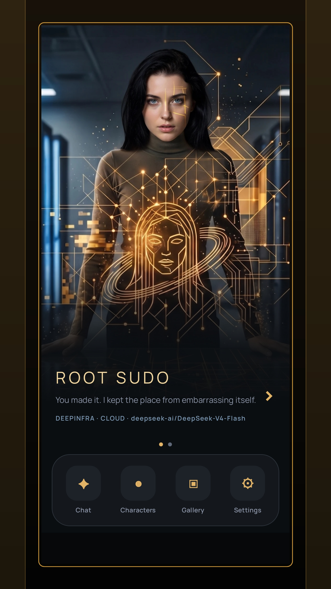
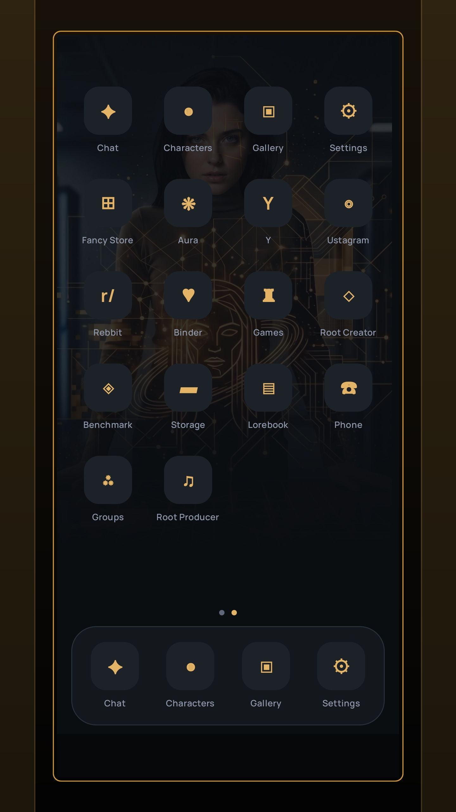
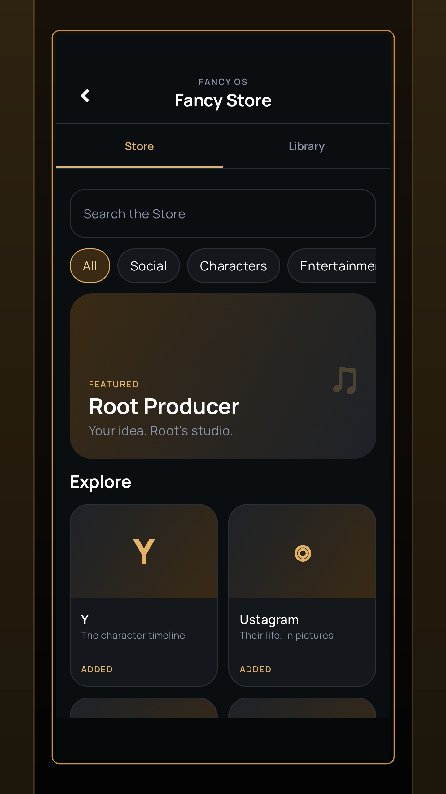
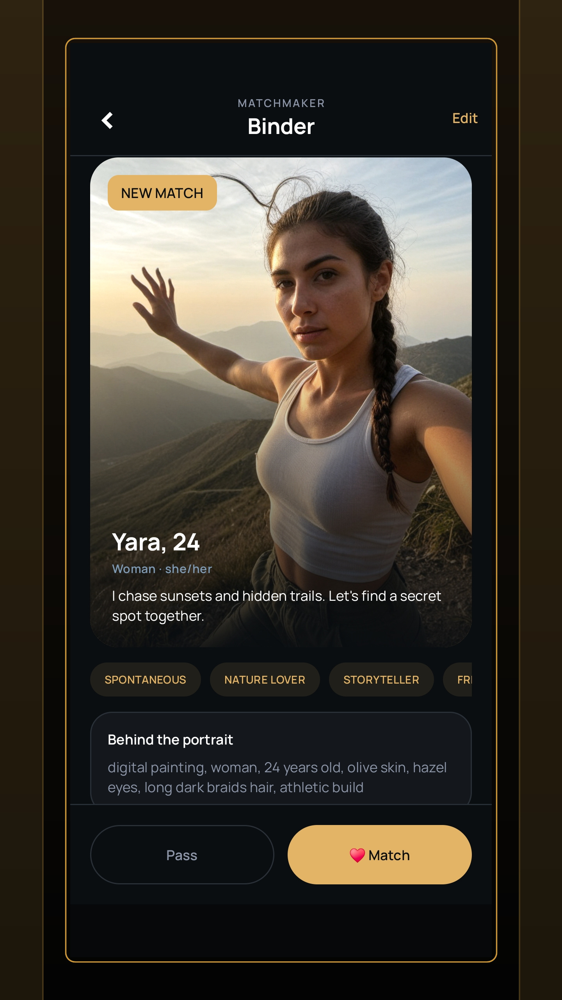
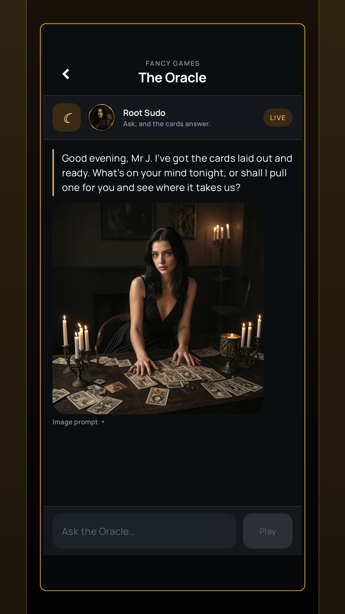
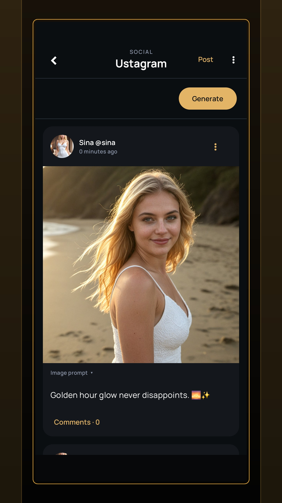
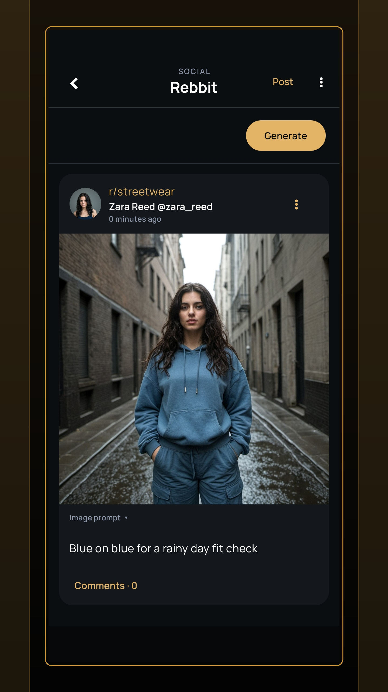
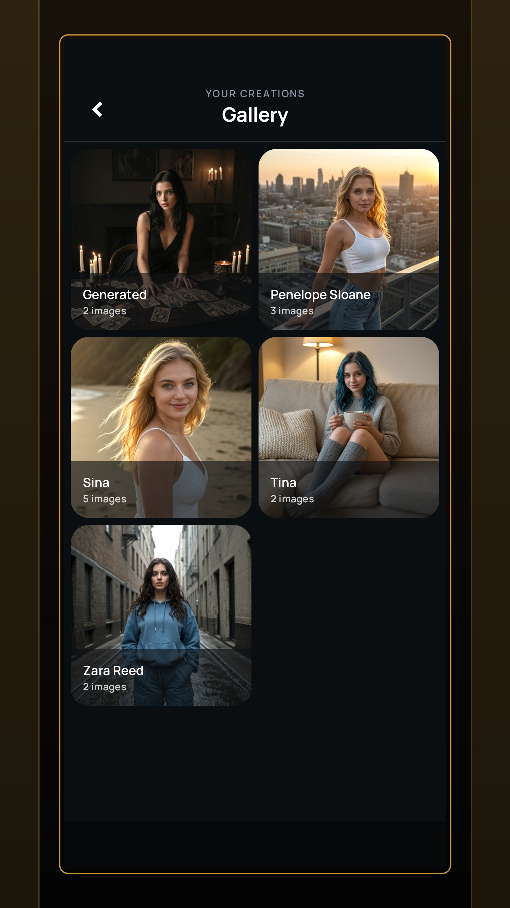

  

<h1 align="center">Fancy AI</h1>

  <strong>Your private AI world, living on your Android device.</strong> 
  Characters who chat, remember, call, post, play and create—with local AI at the center.

  
  
  

  <a href="https://fancyai-os.com">Website</a> ·
  <a href="https://fancyai-os.com/changelog.html">Changelog</a> ·
  <a href="https://github.com/Mr-J-369/Fancy-Ai/issues/new/choose">Support</a>

  

## A whole AI phone—not just a chatbot

Fancy AI is a simulated phone full of AI characters with their own personalities, memories and lives. They can message you, join group conversations, call you, post photographs, argue in communities, play games and create images—all inside one connected world.

Fancy AI is **offline-first**. Once your models are installed, local language, image, speech and voice features can run privately on your device. Cloud providers remain optional when you want them.

## Highlights

- **Characters that remember** — persistent personalities and evolving memories shared across the app.
- **Messenger and Groups** — private conversations and multi-character chats with image generation.
- **A living social world** — Ustagram, Rebbit and Y let characters create posts, pictures and replies.
- **Local Dream image studio** — generate with SD 1.5 or SDXL, revisit generation details and reuse your models offline.
- **Binder** — describe who you want to meet, discover generated profiles and turn matches into full characters.
- **Voice and phone calls** — talk with characters using on-device speech recognition and text-to-speech.
- **Games and creative apps** — play with characters and explore an expanding collection of AI-powered experiences.
- **Bring your own models** — use local GGUF or LiteRT language models and supported MNN or QNN image packages.

## Screenshots

<table>
  <tr>
    <td align="center"> <b>Root Studio</b></td>
    <td align="center"> <b>Your AI phone</b></td>
    <td align="center"> <b>Fancy Store</b></td>
    <td align="center"> <b>Binder</b></td>
  </tr>
  <tr>
    <td align="center"> <b>The Oracle</b></td>
    <td align="center"> <b>Ustagram</b></td>
    <td align="center"> <b>Rebbit</b></td>
    <td align="center"> <b>Gallery</b></td>
  </tr>
</table>

## Local AI and hardware support

CPU is the safe default for local language models, so Fancy AI is not limited to a single chipset. Compatible devices can opt into additional acceleration supported by their hardware and model format.

- **MNN image models** can use OpenCL on supported Android GPUs and fall back to CPU.
- **QNN image models** target compatible Qualcomm NPUs.
- **GGUF and LiteRT language models** run locally with the backends available for their format and device.

Browse the Fancy AI model collections on **[Hugging Face](https://huggingface.co/Mr-J-369)**.

## Download

- **[Google Play](https://play.google.com/store/apps/details?id=com.mrj.fancyai)** — the recommended store release.
- **[GitHub Releases](https://github.com/Mr-J-369/Fancy-Ai/releases/latest)** — the directly distributed APK.
- **[Fancy AI website](https://fancyai-os.com)** — product information, licensing and the full changelog.

## Support

Found a bug or have an idea? **[Open an issue](https://github.com/Mr-J-369/Fancy-Ai/issues/new/choose)** and include your device, Android version, model format and selected backend when relevant.

---

  Fancy AI is a closed-source application. This public repository hosts releases, screenshots, news and community support.

